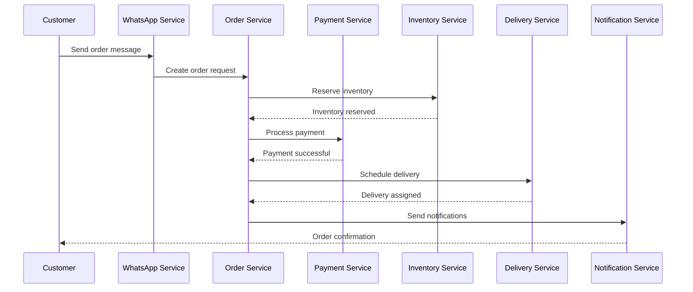

# System Integration Plan

## Executive Summary

This document defines the comprehensive integration strategy for Wakala OS, establishing microservice communication patterns, API contracts, event schemas, and system-wide data flow. The plan ensures seamless interoperability between all system components while maintaining loose coupling and scalability.

## 1. Integration Architecture Overview

### 1.1 Integration Principles
- **Service Autonomy**: Each microservice operates independently with its own data store
- **Event-Driven Communication**: Asynchronous messaging for non-critical operations
- **API-First Design**: Well-defined contracts for synchronous communication
- **Circuit Breaker Pattern**: Fault tolerance for inter-service calls
- **Idempotency**: All operations designed for safe retry
- **Eventual Consistency**: Embracing distributed system realities

### 1.2 Communication Patterns

```
┌─────────────────────────────────────────────────────────────────┐
│                        API Gateway (Kong)                        │
├─────────────────────────────────────────────────────────────────┤
│                    Service Mesh (Istio)                          │
├─────────┬───────────┬───────────┬───────────┬──────────────────┤
│WhatsApp │  Order    │  Payment  │ Delivery  │    Analytics      │
│Service  │  Service  │  Service  │  Service  │    Service        │
├─────────┴───────────┴───────────┴───────────┴──────────────────┤
│                    Message Queue (RabbitMQ)                      │
├─────────────────────────────────────────────────────────────────┤
│                    Event Store (EventStore)                      │
└─────────────────────────────────────────────────────────────────┘
```

## 2. Microservice Communication Matrix

### 2.1 Service Dependencies

| Service | Depends On | Communication Type | Pattern |
|---------|------------|-------------------|---------|
| API Gateway | All Services | HTTP/REST | Request-Response |
| WhatsApp Service | Tenant, Catalog, Order | HTTP/gRPC + Events | Mixed |
| Order Service | Catalog, Payment, Inventory | Events + HTTP | Event Sourcing |
| Payment Service | Order, Notification | HTTP + Events | Saga Pattern |
| Delivery Service | Order, Driver, Notification | Events + WebSocket | Real-time |
| Analytics Service | All Services | Events | Event Streaming |
| Tenant Service | None | HTTP | Request-Response |
| Notification Service | All Services | Events | Pub-Sub |

### 2.2 Communication Protocols

#### Synchronous Communication (REST/gRPC)
```yaml
protocols:
  rest:
    - service-to-service: Internal REST APIs
    - timeout: 3s (default), 30s (payment)
    - retry: 3 attempts with exponential backoff
    - circuit_breaker: 5 failures in 30s opens circuit
  
  grpc:
    - high-performance: Internal service calls
    - streaming: Real-time updates
    - deadline: Context propagation
```

#### Asynchronous Communication (Events)
```yaml
messaging:
  rabbitmq:
    - exchanges:
        - type: topic
          name: wakala.events
          durability: true
    - queues:
        - per-service: {service}.events
        - dead-letter: dlx.{service}
    - patterns:
        - event_sourcing: Order, Payment
        - saga: Multi-service transactions
        - cqrs: Read/Write separation
```

## 3. API Contracts

### 3.1 WhatsApp Service API

```yaml
openapi: 3.0.0
info:
  title: WhatsApp Service API
  version: 1.0.0

paths:
  /webhook:
    post:
      summary: WhatsApp webhook endpoint
      security:
        - HMACAuth: []
      requestBody:
        content:
          application/json:
            schema:
              $ref: '#/components/schemas/WhatsAppWebhook'
      responses:
        '200':
          description: Webhook processed
        '401':
          description: Invalid signature

  /messages/send:
    post:
      summary: Send WhatsApp message
      security:
        - BearerAuth: []
      requestBody:
        content:
          application/json:
            schema:
              $ref: '#/components/schemas/SendMessage'
      responses:
        '200':
          description: Message sent
          content:
            application/json:
              schema:
                $ref: '#/components/schemas/MessageResponse'

components:
  schemas:
    WhatsAppWebhook:
      type: object
      properties:
        entry:
          type: array
          items:
            type: object
            properties:
              id: 
                type: string
              changes:
                type: array
                items:
                  $ref: '#/components/schemas/WebhookChange'
    
    WebhookChange:
      type: object
      properties:
        value:
          type: object
          properties:
            messaging_product:
              type: string
            metadata:
              $ref: '#/components/schemas/Metadata'
            messages:
              type: array
              items:
                $ref: '#/components/schemas/Message'
    
    Message:
      type: object
      properties:
        id:
          type: string
        from:
          type: string
        timestamp:
          type: string
        type:
          enum: [text, image, interactive, location]
        text:
          type: object
          properties:
            body:
              type: string
```

### 3.2 Order Service API

```yaml
openapi: 3.0.0
info:
  title: Order Service API
  version: 1.0.0

paths:
  /orders:
    post:
      summary: Create new order
      security:
        - BearerAuth: []
      requestBody:
        content:
          application/json:
            schema:
              $ref: '#/components/schemas/CreateOrder'
      responses:
        '201':
          description: Order created
          content:
            application/json:
              schema:
                $ref: '#/components/schemas/Order'
    
    get:
      summary: List orders
      parameters:
        - name: tenant_id
          in: header
          required: true
          schema:
            type: string
        - name: status
          in: query
          schema:
            enum: [pending, confirmed, processing, completed, cancelled]
        - name: page
          in: query
          schema:
            type: integer
            default: 1
        - name: limit
          in: query
          schema:
            type: integer
            default: 20

  /orders/{orderId}:
    get:
      summary: Get order details
      parameters:
        - name: orderId
          in: path
          required: true
          schema:
            type: string
            format: uuid

components:
  schemas:
    CreateOrder:
      type: object
      required:
        - customer_id
        - items
        - delivery_address
      properties:
        customer_id:
          type: string
          format: uuid
        items:
          type: array
          items:
            $ref: '#/components/schemas/OrderItem'
        delivery_address:
          $ref: '#/components/schemas/Address'
        payment_method:
          enum: [card, eft, cash, mobile_money]
        notes:
          type: string
    
    OrderItem:
      type: object
      required:
        - product_id
        - quantity
        - price
      properties:
        product_id:
          type: string
          format: uuid
        quantity:
          type: integer
          minimum: 1
        price:
          type: number
          format: decimal
        vendor_id:
          type: string
          format: uuid
```

### 3.3 Payment Service API

```yaml
openapi: 3.0.0
info:
  title: Payment Service API
  version: 1.0.0

paths:
  /payments:
    post:
      summary: Process payment
      security:
        - BearerAuth: []
      requestBody:
        content:
          application/json:
            schema:
              $ref: '#/components/schemas/ProcessPayment'
      responses:
        '200':
          description: Payment processed
          content:
            application/json:
              schema:
                $ref: '#/components/schemas/PaymentResult'
        '402':
          description: Payment failed
          content:
            application/json:
              schema:
                $ref: '#/components/schemas/PaymentError'

  /payments/{paymentId}/refund:
    post:
      summary: Refund payment
      parameters:
        - name: paymentId
          in: path
          required: true
          schema:
            type: string
      requestBody:
        content:
          application/json:
            schema:
              $ref: '#/components/schemas/RefundRequest'

components:
  schemas:
    ProcessPayment:
      type: object
      required:
        - order_id
        - amount
        - currency
        - method
      properties:
        order_id:
          type: string
          format: uuid
        amount:
          type: number
          format: decimal
        currency:
          type: string
          default: ZAR
        method:
          enum: [paystack, ozow, mpesa, cash]
        customer:
          $ref: '#/components/schemas/Customer'
        metadata:
          type: object
```

## 4. Event Schemas

### 4.1 Event Envelope

```json
{
  "event_id": "uuid",
  "event_type": "order.created",
  "version": "1.0",
  "timestamp": "2024-01-01T12:00:00Z",
  "tenant_id": "uuid",
  "correlation_id": "uuid",
  "causation_id": "uuid",
  "actor": {
    "type": "user|system|service",
    "id": "uuid"
  },
  "data": {},
  "metadata": {
    "source": "order-service",
    "destination": ["payment-service", "inventory-service"],
    "priority": "high|normal|low"
  }
}
```

### 4.2 Domain Events

#### Order Events
```yaml
order.created:
  data:
    order_id: uuid
    customer_id: uuid
    items: array
    total_amount: decimal
    created_at: timestamp

order.confirmed:
  data:
    order_id: uuid
    confirmed_at: timestamp
    vendor_id: uuid

order.completed:
  data:
    order_id: uuid
    completed_at: timestamp
    delivery_id: uuid

order.cancelled:
  data:
    order_id: uuid
    cancelled_at: timestamp
    reason: string
    cancelled_by: uuid
```

#### Payment Events
```yaml
payment.initiated:
  data:
    payment_id: uuid
    order_id: uuid
    amount: decimal
    method: string
    gateway: string

payment.succeeded:
  data:
    payment_id: uuid
    order_id: uuid
    transaction_id: string
    paid_at: timestamp

payment.failed:
  data:
    payment_id: uuid
    order_id: uuid
    error_code: string
    error_message: string
    failed_at: timestamp
```

#### Delivery Events
```yaml
delivery.assigned:
  data:
    delivery_id: uuid
    order_id: uuid
    driver_id: uuid
    assigned_at: timestamp

delivery.picked_up:
  data:
    delivery_id: uuid
    picked_up_at: timestamp
    location: object

delivery.completed:
  data:
    delivery_id: uuid
    delivered_at: timestamp
    signature: string
    photo_url: string
```

### 4.3 Integration Events

```yaml
whatsapp.message.received:
  data:
    message_id: string
    from: string
    type: string
    content: object
    received_at: timestamp

notification.sent:
  data:
    notification_id: uuid
    recipient: string
    channel: string
    template: string
    sent_at: timestamp

inventory.updated:
  data:
    product_id: uuid
    vendor_id: uuid
    old_quantity: integer
    new_quantity: integer
    reason: string
```

## 5. Data Flow Diagrams

### 5.1 Order Processing Flow



### 5.2 Event Flow Architecture

```
┌─────────────┐     ┌─────────────┐     ┌─────────────┐
│  WhatsApp   │     │    Order    │     │   Payment   │
│   Service   │     │   Service   │     │   Service   │
└──────┬──────┘     └──────┬──────┘     └──────┬──────┘
       │                   │                   │
       │ message.received  │ order.created     │ payment.processed
       ▼                   ▼                   ▼
┌─────────────────────────────────────────────────────┐
│                   Event Bus (RabbitMQ)               │
└─────────────────────────────────────────────────────┘
       │                   │                   │
       ▼                   ▼                   ▼
┌──────┴──────┐     ┌──────┴──────┐     ┌──────┴──────┐
│  Analytics  │     │  Inventory  │     │  Delivery   │
│   Service   │     │   Service   │     │   Service   │
└─────────────┘     └─────────────┘     └─────────────┘
```

## 6. Service Mesh Configuration

### 6.1 Istio Service Definitions

```yaml
apiVersion: networking.istio.io/v1alpha3
kind: VirtualService
metadata:
  name: order-service
spec:
  hosts:
  - order-service
  http:
  - timeout: 10s
    retries:
      attempts: 3
      perTryTimeout: 3s
      retryOn: 5xx,reset,connect-failure
    fault:
      delay:
        percentage:
          value: 0.1
        fixedDelay: 5s
---
apiVersion: networking.istio.io/v1alpha3
kind: DestinationRule
metadata:
  name: order-service
spec:
  host: order-service
  trafficPolicy:
    connectionPool:
      tcp:
        maxConnections: 100
      http:
        http1MaxPendingRequests: 50
        http2MaxRequests: 100
    outlierDetection:
      consecutiveErrors: 5
      interval: 30s
      baseEjectionTime: 30s
      maxEjectionPercent: 50
```

### 6.2 Circuit Breaker Configuration

```yaml
resilience:
  circuit_breaker:
    failure_threshold: 5
    recovery_timeout: 30s
    expected_response_time: 3s
    
  retry:
    max_attempts: 3
    backoff:
      initial: 100ms
      max: 10s
      multiplier: 2
    
  timeout:
    default: 3s
    payment_service: 30s
    whatsapp_webhook: 3s
```

## 7. Integration Security

### 7.1 Service Authentication

```yaml
authentication:
  internal:
    type: mTLS
    certificate_authority: internal-ca
    certificate_rotation: 30d
    
  external:
    type: JWT
    issuer: https://auth.wakala.os
    audience: wakala-api
    algorithms: [RS256]
```

### 7.2 API Gateway Security

```yaml
kong_plugins:
  - name: jwt
    config:
      key_claim_name: kid
      claims_to_verify:
        - exp
        - tenant_id
  
  - name: rate-limiting
    config:
      minute: 100
      hour: 5000
      policy: tenant
  
  - name: request-transformer
    config:
      add:
        headers:
          - X-Tenant-ID:$(jwt.tenant_id)
          - X-Request-ID:$(uuid)
```

## 8. Monitoring and Observability

### 8.1 Distributed Tracing

```yaml
tracing:
  provider: jaeger
  sampling_rate: 0.1
  propagation: w3c-trace-context
  
  span_attributes:
    - tenant_id
    - user_id
    - order_id
    - correlation_id
```

### 8.2 Integration Metrics

```yaml
metrics:
  service_communication:
    - request_duration_seconds
    - request_size_bytes
    - response_size_bytes
    - error_rate
    
  message_queue:
    - messages_published_total
    - messages_consumed_total
    - message_processing_duration
    - dead_letter_queue_size
    
  circuit_breaker:
    - circuit_breaker_state
    - circuit_breaker_calls_total
    - circuit_breaker_failures_total
```

## 9. Error Handling and Recovery

### 9.1 Compensation Patterns

```yaml
saga_definitions:
  order_processing:
    steps:
      - service: order-service
        action: create_order
        compensation: cancel_order
      
      - service: inventory-service
        action: reserve_stock
        compensation: release_stock
      
      - service: payment-service
        action: process_payment
        compensation: refund_payment
      
      - service: delivery-service
        action: schedule_delivery
        compensation: cancel_delivery
```

### 9.2 Dead Letter Queue Handling

```yaml
dlq_processing:
  retry_strategy:
    max_retries: 3
    backoff_multiplier: 2
    max_backoff: 1h
    
  alerting:
    threshold: 100
    channels:
      - slack
      - pagerduty
```

## 10. Integration Testing Strategy

### 10.1 Contract Testing

```yaml
pact_contracts:
  - consumer: whatsapp-service
    provider: order-service
    interactions:
      - description: create order
        request:
          method: POST
          path: /orders
        response:
          status: 201
          
  - consumer: order-service
    provider: payment-service
    interactions:
      - description: process payment
        request:
          method: POST
          path: /payments
        response:
          status: 200
```

### 10.2 Integration Test Scenarios

```yaml
integration_tests:
  - name: end_to_end_order_flow
    steps:
      - send_whatsapp_message
      - verify_order_created
      - verify_payment_processed
      - verify_delivery_scheduled
      - verify_notifications_sent
    
  - name: payment_failure_handling
    steps:
      - create_order
      - simulate_payment_failure
      - verify_order_cancelled
      - verify_stock_released
      - verify_failure_notification
```

## 11. Deployment Dependencies

### 11.1 Service Startup Order

```yaml
deployment_order:
  - level_1:
      - postgres
      - redis
      - rabbitmq
      - elasticsearch
  
  - level_2:
      - tenant-service
      - configuration-service
  
  - level_3:
      - catalog-service
      - inventory-service
      - notification-service
  
  - level_4:
      - whatsapp-service
      - order-service
      - payment-service
      - delivery-service
  
  - level_5:
      - api-gateway
      - analytics-service
```

### 11.2 Health Check Dependencies

```yaml
health_checks:
  order_service:
    dependencies:
      - postgres: required
      - redis: required
      - rabbitmq: required
      - inventory-service: degraded
      - payment-service: degraded
```

## 12. Performance Optimization

### 12.1 Caching Strategy

```yaml
caching:
  service_responses:
    - endpoint: /products
      ttl: 5m
      key_pattern: "products:tenant:{tenant_id}:page:{page}"
    
    - endpoint: /vendors/{id}
      ttl: 15m
      key_pattern: "vendor:{id}"
  
  event_deduplication:
    ttl: 24h
    key_pattern: "event:{event_id}"
```

### 12.2 Batch Processing

```yaml
batch_processing:
  notification_service:
    batch_size: 100
    flush_interval: 1s
    
  analytics_service:
    batch_size: 1000
    flush_interval: 5s
```

## Conclusion

This integration plan provides a comprehensive framework for connecting all Wakala OS microservices while maintaining system reliability, scalability, and maintainability. The event-driven architecture with proper circuit breakers and compensation patterns ensures the system can handle failures gracefully while providing a seamless experience for township businesses.